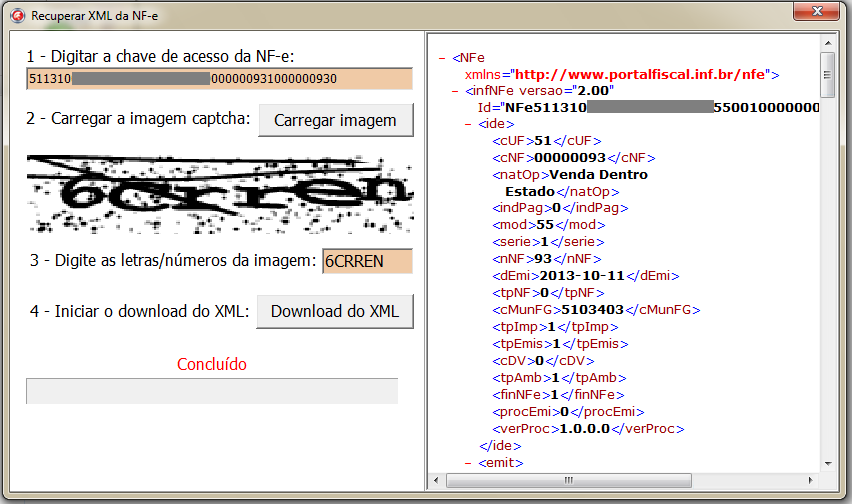

# RecuperarNFe

## Sobre

  * Recuperação dos arquivos XML da NF-e (Nota Fiscal Eletrônica) pelo site da Receita Federal.
  
  * Compilado com Delphi XE2.
  
  * Contribua com melhorias e manutenção criando pull requests (https://github.com/leogregianin/recuperarnfe/pulls) e issues (https://github.com/leogregianin/recuperarnfe/issues).

## Compilação

  * Instalação do componente ACBr disponível no repositório svn://svn.code.sf.net/p/acbr/code/trunk2
  
  * Copiar os arquivos .dll da pasta "DLL" para "..\Windows\System32" ou "..\Windows\SysWOW64"

  * Abrir o arquivo ..\Project\RecuperarNFe.dpr e compilar.

## Executáveis

  * [InstaladorRecuperarNFe.exe](https://github.com/leogregianin/recuperarnfe/raw/master/Instalador/InstaladorRecuperarNFe.exe)
  * [RecuperarNFe.exe](https://github.com/leogregianin/recuperarnfe/raw/master/Bin/RecuperarNFe.exe)

## Screenshot

